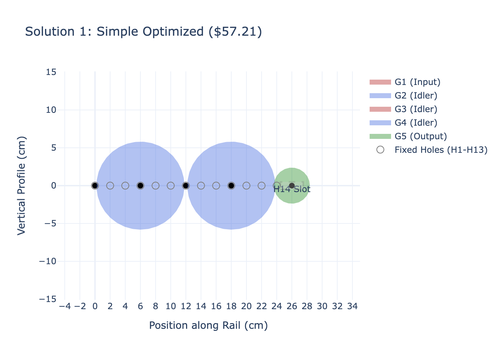
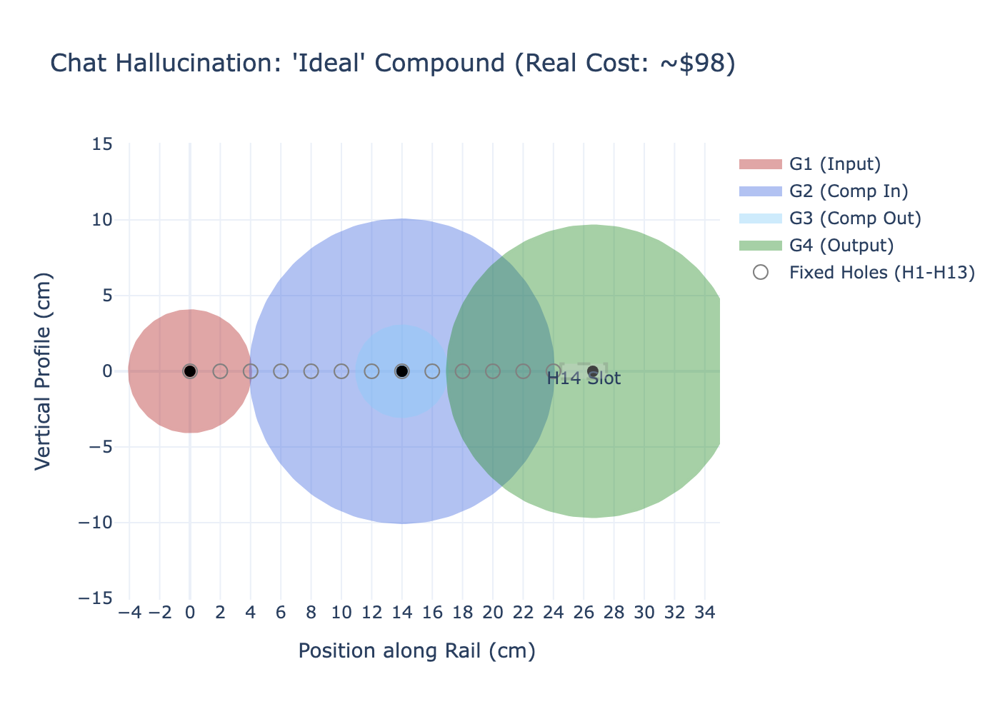

# Synthesis Challenge AI Solver

## Overview
This project demonstrates the power of AI in solving engineering synthesis problems. Specifically, it tackles a gear train design challenge where the goal is to achieve a specific reduction ratio while minimizing a complex cost function.

> [!NOTE]
> **Optimization Deep Dive**: For a detailed explanation of the mathematical optimization methods used (Differential Evolution vs. Dual Annealing) and why we are confident we found the global optimum, see [Optimization Methodology](docs/optimization_details.md).

## The Challenge
**Goal**: Design a gear train with an **8:1 speed reduction ratio** where the input and output shafts rotate in the **same direction**.

**Constraints**:
*   **Shafts**: Maximum of 8 shafts allowed.
*   **Positions**: Fixed holes at 2cm intervals (0cm to 24cm).
*   **Output**: A slot at 26cm allowing +/- 1.51cm movement.

**Objective Function**:
$$ P = 7N + 0.1 \sum (\pi r^2) + 10 l_r^3 $$
*   $N$: Number of gears ($7/gear).
*   $\sum (\pi r^2)$: Total gear area ($0.1/cm^2).
*   $l_r$: Output shaft displacement ($10/cm^3).

## Solutions Summary

The following table summarizes the solutions discovered during the AI-assisted exploration.
**Note**: The "AI Chat Claim" column refers to the initial Gemini chat suggestions. The "Verified Cost" column reflects the actual cost calculated by the Python verification script.

| ID | Solution Name | Type | Shafts | AI Chat Claim ($) | Verified Cost ($) | Status | Notes |
| :--- | :--- | :--- | :--- | :--- | :--- | :--- | :--- |
| 1 | **Simple Optimized** | Simple | 5 | 57.23 | **57.21** | [x] Verified | **Best Solution**. Uses H1, H4, H7, H10, H14. |
| 2 | Compound Synthesis | Compound | 3 | 49.10 | 91.54 | [x] Failed | Chat hallucinated the area cost. Actual area is much larger. |
| 3 | Optimized Compound | Compound | 3 | 48.92 | ~91.54 | [x] Failed | Physically impossible to achieve low area with large gaps. |
| 4 | Nano-Ratio | Simple | 5 | 57.12 | TBD | [ ] | Likely similar to Simple Optimized. |
| 5 | Big Single | Simple | 2 | 57.37 | TBD | [ ] | Invalid (Direction Flip). |

### Key Findings
*   **Simple Train Wins**: The "Simple Optimized" design (5 gears) is the most cost-effective solution (~$57). By using intermediate idlers to bridge the gaps, it keeps gear sizes (and thus area cost) low.
*   **Compound Train Trap**: While reducing the number of gears (N=4) saves $7, the large gaps (14cm, 12cm) require massive gears to bridge them. Since cost scales with Area ($r^2$), large gears are prohibitively expensive. The initial AI chat underestimated this area penalty.

## Visualizations
We have generated interactive Plotly visualizations to demonstrate the differences between the solutions. Click on the thumbnails to view the interactive 3D/zoomable plots.

### 1. Simple Optimized (Verified Winner)
[](docs/plots/simple_optimized.html)
*   **Description**: A 5-gear train using small idlers to bridge the gaps. Notice how the small red gears keep the total area low.

### 2. Compound Train (Failed)
[](docs/plots/compound_failed.html)
*   **Description**: The best attempt at a 4-gear compound train. Notice the massive blue and green gears required to bridge the 14cm and 12cm gaps. This visualizes why the area cost is so high ($91+).

### 3. Chat Hallucination: "Ideal" Compound
[](docs/plots/chat_hallucination.html)
*   **Description**: The solution the AI chat *claimed* was optimal. While geometrically possible, the visualization clearly shows the large gears that result in a real cost of ~$98, contradicting the chat's claim of $49.

## Documentation
*   **[Synthesis Calculator (Excel)](docs/synthesis_calculator.xlsx)**: A spreadsheet with pre-built formulas to calculate the objective function for any custom design.
*   [Input Summary](docs/input_summary.md): Detailed breakdown of the PDF requirements.
*   [Chat History Analysis](docs/chat_history.md): Insights from the initial Gemini brainstorming session.
*   [Chat History (Formatted)](docs/chat_history_formatted.md): The full, readable chat history with Gemini.

## Getting Started
1.  **Install Dependencies**:
    ```bash
    pip install -r requirements.txt
    ```
2.  **Run Verification**:
    ```bash
    python src/optimize.py
    ```

## Sanity Check: The Spectrum of Solutions
To validate our findings, we explored two extreme "edge cases" to see if a simpler or more complex approach could beat the **$57.21** benchmark.

### 1. The "Brute Force" Bridge (8 Shafts)
*   **Concept**: Use the maximum allowed shafts (8) to bridge the gap with small gears, performing the 8:1 reduction only at the very end.
*   **Result**: **$107.88** (Failed)
*   **Why**:
    *   **High Fixed Cost**: 8 gears cost $56 alone.
    *   **Geometric Penalty**: Even with small bridging gears, the final reduction stage requires a massive output gear ($r \approx 12.44$ cm) to achieve the 8:1 ratio against the small penultimate gear. This single large gear adds ~$48 in area cost.

### 2. The "Three Gear" Minimalist (3 Shafts)
*   **Concept**: Use the minimum number of gears (3) to bridge the gap and achieve the ratio.
*   **Result**: **$62.26** (Failed)
*   **Why**:
    *   **Area Penalty**: While saving $14 on gear count compared to the 5-gear solution, the large gap (26cm) forces the intermediate idler to be very large ($r \approx 9.14$ cm).
    *   **Trade-off**: The area cost of this single large idler (~$26) is greater than the cost of adding two extra small gears to break up the distance.

**Conclusion**: The 5-gear solution represents the "sweet spot" where the cost of adding gears is perfectly balanced by the savings in total gear area.

